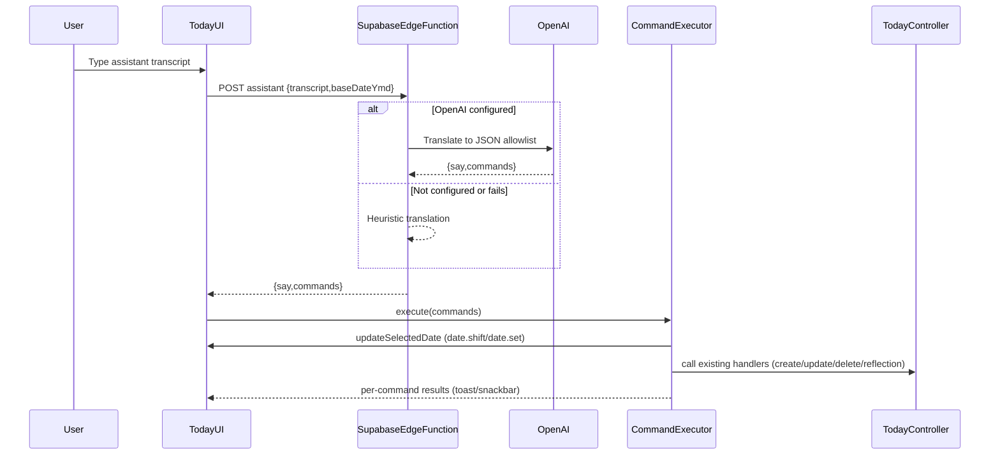

# AI Commands / Voice Assistant (Flutter + Supabase Edge Function)

## What we’ll implement

- **Server translator**: a Supabase Edge Function `POST /assistant` that authenticates the user, enforces guardrails (Origin allowlist, RPM limit, size limits), translates transcript → `{ say, commands[] }` via **OpenAI when configured** with a **heuristic fallback**, and validates/drops invalid commands.
- **Client UI + executor (Today screen)**: a small “Assistant” input on Today that calls the translator (or local heuristics when offline/demo), then **executes commands sequentially** by calling the same trusted code paths you already use (`TodayController.addTask`, `toggleTaskCompleted`, `deleteTask`, `setReflection`, etc.).
- **Command allowlist**: matches `docs/AI_COMMANDS_IMPLEMENTATION_REQUIREMENTS.md` exactly.

## Key repo discovery (why this fits cleanly)

- `TodayScreen` already has date context (`ymd`) and uses `TodayController` CRUD methods (tasks + reflection), so the executor can stay deterministic and safe.
- Current data layer only has **tasks** (`/Users/evan.beyrer/workspace/winFlutter/lib/data/tasks/**`). There is no habits repository/UI yet; we’ll add a minimal one so the assistant’s habit commands are actually usable.

## Architecture

## Server-side: Supabase Edge Function

### New files

- Add Supabase function:
- `/Users/evan.beyrer/workspace/winFlutter/supabase/functions/assistant/index.ts`
- Optional shared helpers:
    - `/Users/evan.beyrer/workspace/winFlutter/supabase/functions/_shared/validation.ts`
    - `/Users/evan.beyrer/workspace/winFlutter/supabase/functions/_shared/heuristics.ts`
    - `/Users/evan.beyrer/workspace/winFlutter/supabase/functions/_shared/rate_limit.ts`

### Behavior (per docs)

- **Auth required**: verify user via JWT from `Authorization` header (using `@supabase/supabase-js` in the function).
- **Origin allowlist**:
- If `Origin` header is present and not in `ASSISTANT_ALLOWED_ORIGINS` → `403`.
- If `Origin` is absent (mobile) → allow.
- **Rate limiting** (per-user RPM): in-memory sliding window keyed by user id; respond `429` with `Retry-After`.
- **Input limits**:
- `transcript` required, trimmed, max `ASSISTANT_MAX_TRANSCRIPT_CHARS` (default 2000)
- `baseDateYmd` required, validated `YYYY-MM-DD`
- **LLM translation**:
- Only if `OPENAI_API_KEY` set.
- Low temperature (0), conservative tokens, timeout (default `ASSISTANT_OPENAI_TIMEOUT_MS=12000`).
- Constrained prompt: “Return ONLY JSON; only these command kinds; date commands first; don’t invent data.”
- **Output validation**:
- `say` max length 240
- `commands` max length 5
- Drop unknown kinds / invalid shapes silently.
- Optional `debug` field when `ASSISTANT_DEBUG=true` (never secrets).

## Client-side: Flutter assistant UI, client, and executor

### New Dart files

- Command model + parsing:
- `/Users/evan.beyrer/workspace/winFlutter/lib/assistant/assistant_models.dart`
- Client for server translation + demo fallback:
- `/Users/evan.beyrer/workspace/winFlutter/lib/assistant/assistant_client.dart`
- Heuristic translator (client-side fallback for demo/offline/unconfigured):
- `/Users/evan.beyrer/workspace/winFlutter/lib/assistant/assistant_heuristics.dart`
- Deterministic executor (sequential, date-context aware):
- `/Users/evan.beyrer/workspace/winFlutter/lib/assistant/assistant_executor.dart`

### Integrations

- **Today UI** (`/Users/evan.beyrer/workspace/winFlutter/lib/features/today/today_screen.dart`):
- Add an “Assistant” card with:
    - transcript `TextField`
    - Send button
    - shows assistant `say`
- On submit:
    - call `AssistantClient.translate(transcript, baseDateYmd)`
    - run `AssistantExecutor.execute(...)`

### Executor details (per docs)

- Maintain `execDate` starting at the currently selected Today date.
- `date.shift` / `date.set` update `execDate` and call back into Today UI to update selection.
- Task matching by `title`:
- exact case-insensitive match
- else substring match (prefer shortest)
- if no match: show non-fatal error and continue
- Habit matching by `name`: same rules.
- **Destructive actions**:
- For `task.delete`, show a confirm dialog before executing.
- Also confirm when the translated command list contains >1 action (optional, but recommended by your spec; we’ll implement a lightweight confirmation sheet).

## Habits + reflection support in this Flutter repo

- **Reflection**: already stored via `TodayController.setReflection`; assistant commands will map to it (`append` does string concat + newline).
- **Habits**: not implemented yet, but required by the command allowlist.
- Add a minimal local habits data layer (SharedPreferences) and a simple Habits section on Today so habit commands are visible and testable.
- Files:
    - `/Users/evan.beyrer/workspace/winFlutter/lib/data/habits/habit.dart`
    - `/Users/evan.beyrer/workspace/winFlutter/lib/data/habits/habits_repository.dart`
    - `/Users/evan.beyrer/workspace/winFlutter/lib/data/habits/local_habits_repository.dart`
    - `/Users/evan.beyrer/workspace/winFlutter/lib/data/habits/habits_providers.dart`
    - Update `/Users/evan.beyrer/workspace/winFlutter/lib/features/today/today_controller.dart` to expose habit create/toggle APIs used by executor.
- Supabase-backed habits can be added later once tables/migrations are defined; v1 will work in demo/local mode immediately.

## Config + docs updates

- Add a short setup doc:
- `/Users/evan.beyrer/workspace/winFlutter/docs/AI_COMMANDS_SETUP.md`
- includes Supabase CLI commands to serve/deploy the edge function and env vars to set.
- Update `/Users/evan.beyrer/workspace/winFlutter/assets/env.example` to clarify which vars are **client-side** vs **edge-function-only**.

## Tests (small but meaningful)

- Add Dart unit tests for:
- heuristic parsing → commands
- title/name matching behavior
- date shift/set sequencing
- Files:
    - `/Users/evan.beyrer/workspace/winFlutter/test/assistant/assistant_heuristics_test.dart`
    - `/Users/evan.beyrer/workspace/winFlutter/test/assistant/assistant_executor_match_test.dart`

## Deliverables checklist

- Typed assistant input on Today works in:
- demo/unconfigured (client heuristics)
- signed-in Supabase mode (edge function translation)
- Returned commands execute via trusted handlers; non-fatal errors don’t crash.